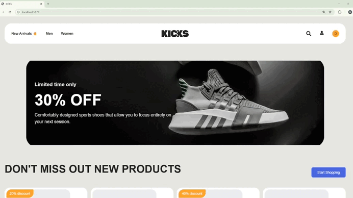

# Shoes App - E-commerce Project
In this project:

# 🛠️ Technologies Used:

Frontend: React + TypeScript

State Management: React Query (TanStack Query)

Form Management: Formik + Yup

Styling: Tailwind CSS

HTTP Client: Axios

Routing: React Router DOM

Backend Integration: REST API

Authentication: JWT (JSON Web Tokens)

# 🎯 Key Features:

Product listing and detail views

Secure admin panel (Authentication & Authorization)

CRUD operations through admin panel

Form validations

Responsive design

Product filtering and search

Category-based product management

Secure session management

Access and Refresh token implementation

# 📚 What I Learned:

Server state management with React Query

Type-safe development with TypeScript

Form validations using Formik and Yup

Modern and responsive design with Tailwind CSS

REST API integration

Writing maintainable code using clean code principles

Project management with Git version control

Component-based architecture

Error handling and loading states management

Implementing secure authentication with JWT

Protected routes implementation

Role-based access control (RBAC) management

Secure token storage with HTTP-only cookies

# Preview of the Project

